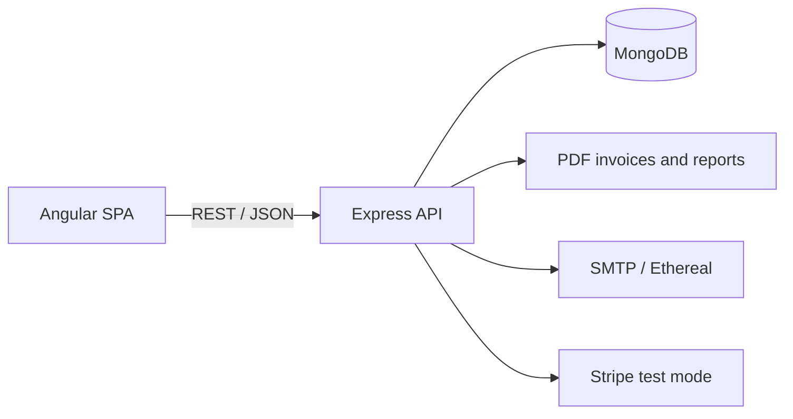

# Printing House

> A full-stack marketplace that connects print customers with print shops—from product discovery and print preparation to ordering, tenders, invoicing, and payment.


<p align="center">
  
</p>

Printing House is a role-based web platform for three groups of users: customers (individuals and companies), print shops, and system administrators. It covers the complete ordering lifecycle while also supporting public procurement workflows, inventory management, analytics, PDF documents, email delivery, and Stripe test payments.

This project was developed for the **Internet Application Programming** course during the 2025/26 academic year.

## Highlights

- **Role-based experience** for customers, print shops, and administrators
- **Product discovery** with search, categories, galleries, ratings, and print-shop locations
- **Interactive print preparation** with text/image positioning, print size, color, quantity, and service selection
- **Shopping cart and fulfillment** split by print shop, with order status tracking and cancellation
- **Public procurement and bidding** with stock-aware winner selection and downloadable PDF reports
- **Inventory management** with manual editing and JSON batch import
- **Administration** of registration requests, users, categories, and three analytics views
- **PDF invoicing and email delivery** through SMTP or zero-configuration Ethereal test mail
- **Stripe test payments** with an offline local simulation mode for development
- **Ratings, comments, order history, and product archive** after fulfillment

## Tech stack

| Layer | Technologies |
| --- | --- |
| Frontend | Angular 20, TypeScript, RxJS, Stripe.js |
| Backend | Node.js, Express 5, TypeScript |
| Database | MongoDB, Mongoose |
| Authentication | JWT, bcrypt |
| Files and documents | Multer, PDFKit |
| Email | Nodemailer, Ethereal or SMTP |
| Payments | Stripe Payment Intents or local test simulation |

## Architecture



The frontend and backend are separate applications. Angular owns presentation, routing, guards, and browser-side state; Express owns validation, authorization, business rules, document generation, and persistence.

## Getting started

### Prerequisites

- Node.js and npm
- MongoDB available at `mongodb://127.0.0.1:27017`

On Windows, a locally installed MongoDB service can usually be started from an elevated terminal with:

```powershell
net start MongoDB
```

### 1. Install and seed the backend

```bash
cd backend_Node
npm install
npm run seed
```

> [!WARNING]
> `npm run seed` recreates the application's collections and indexes before inserting demo data. Do not point it at a database that contains data you need to keep.

Database creation is intentionally independent from the running application: Mongoose `autoCreate` and `autoIndex` are disabled, so the seed script is the single source of truth for collections and indexes.

### 2. Start the API

```bash
cd backend_Node
npm start
```

The API listens on `http://localhost:4000` by default.

### 3. Start the frontend

In a second terminal:

```bash
cd frontend
npm install
npm start
```

Open `http://localhost:4200`.

## Configuration

The application works locally without an `.env` file. For custom settings, copy `backend_Node/.env.example` to `backend_Node/.env` and update only the values you need.

| Variable | Default | Purpose |
| --- | --- | --- |
| `PORT` | `4000` | API port |
| `MONGO_URI` | local `printing_house_v2` database | MongoDB connection string |
| `CLIENT_URL` | `http://localhost:4200` | Allowed frontend origin |
| `JWT_SECRET` | development-only fallback | JWT signing secret; set your own outside local development |
| `JWT_EXPIRES_IN` | `12h` | Access token lifetime |
| `SMTP_HOST`, `SMTP_PORT`, `SMTP_USER`, `SMTP_PASS` | empty / `587` | Optional SMTP delivery; empty credentials enable Ethereal |
| `MAIL_FROM` | local project sender | Sender shown on invoice emails |
| `STRIPE_SECRET_KEY`, `STRIPE_PUBLISHABLE_KEY` | empty | Optional Stripe **test-mode** credentials |
| `STRIPE_CURRENCY` | `rsd` | Charge currency; use a currency supported by your Stripe account |

> [!IMPORTANT]
> `.env` is ignored by Git and must never be committed. Keep MongoDB credentials, JWT secrets, SMTP passwords, and Stripe secret keys only in your local environment or a deployment secret store. Only `.env.example` belongs in the repository.

### Email behavior

With empty SMTP settings, the backend creates an Ethereal test inbox and returns a preview URL after checkout. Messages are not delivered to real recipients. If email delivery fails, the order remains valid and its PDF invoice can still be downloaded from the Orders page.

### Payment behavior

The payment flow chooses one of two explicit modes:

- **Local simulation** when Stripe keys are absent. Official Stripe test card numbers are interpreted locally, so the demo works offline.
- **Stripe Test Mode** when both test keys are present. Stripe Elements collects card details directly; card numbers and CVC values never pass through the Angular app or backend and are never stored in MongoDB.

The backend verifies the Payment Intent amount, currency, customer, and invoice ownership before updating payment status. If `rsd` is not supported by the connected test account, set `STRIPE_CURRENCY=usd` (or another supported test currency).

## Demo accounts

All credentials below are generated by `npm run seed` and are intended **only for local demonstration**.

| Role | Username | Password | Notes |
| --- | --- | --- | --- |
| Administrator | `admin` | `Admin123!` | Sign in at `/admin/prijava` |
| Print shop | `copystudio` | `Stampar1!` | Belgrade inventory and orders |
| Individual customer | `pera` | `Klijent1!` | Search, cart, orders, and ratings |
| Company customer | `etf` | `Pravno11!` | Includes a completed public procurement example |

Additional seeded accounts cover multiple cities, approval states, order statuses, ratings, and procurement outcomes. The administrator sign-in route is intentionally separate and is not linked from the public navigation.

### Seeded procurement scenario

The `etf` account contains procurement `JN-2026-0001` with three bids and a PDF report. The second-lowest bid wins because the cheapest print shop does not have enough stock—winner selection validates both price and the available quantity of every requested product.

To demonstrate live bidding, create a procurement as a company customer, then sign in as one or more print shops and submit offers before the deadline.

## Available scripts

### Backend (`backend_Node`)

| Command | Description |
| --- | --- |
| `npm start` | Run the API with `ts-node` |
| `npm run build` | Compile TypeScript to `dist/` |
| `npm run serve` | Run the compiled API |
| `npm run seed` | Recreate collections, indexes, demo data, and sample uploads |

### Frontend (`frontend`)

| Command | Description |
| --- | --- |
| `npm start` | Start the Angular development server |
| `npm run build` | Create a production build |
| `npm test` | Run the Angular test runner |
| `npm run watch` | Rebuild continuously in development mode |

## Project structure

```text
.
├── backend_Node/
│   ├── src/
│   │   ├── config/       # Environment and database connection
│   │   ├── controllers/  # Business logic
│   │   ├── middleware/   # JWT authorization and uploads
│   │   ├── models/       # Mongoose schemas
│   │   ├── routers/      # REST endpoints and access control
│   │   ├── seed/         # Database and demo-data setup
│   │   └── utils/        # Validation, mapping, mail, PDF, and payments
│   └── .env.example
├── frontend/
│   └── src/app/
│       ├── models/       # Shared frontend data types
│       ├── services/     # API clients, auth, guards, and interceptors
│       └── */            # Feature/page components
└── docs/images/          # README screenshots
```

## Security notes

- Passwords are hashed with bcrypt.
- Protected API routes validate JWTs and enforce role-based permissions.
- Uploaded files are validated and stored outside version control.
- Payment card data is never persisted by the application.
- Secrets are loaded from environment variables; local `.env` files are excluded by `.gitignore`.
- This is an academic/demo system. Review configuration, validation, logging, and deployment hardening before any production use.

## Project status

The course requirements are implemented end to end: authentication, product and inventory management, administration, print preparation, cart and orders, public procurement, ratings, analytics, PDF generation, email delivery, and card-payment integration.
