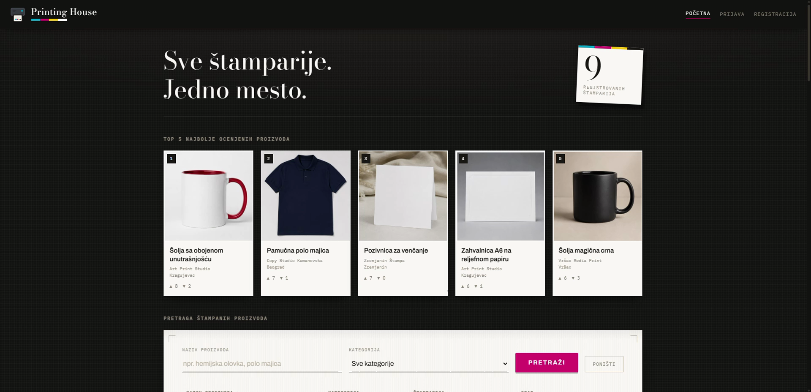
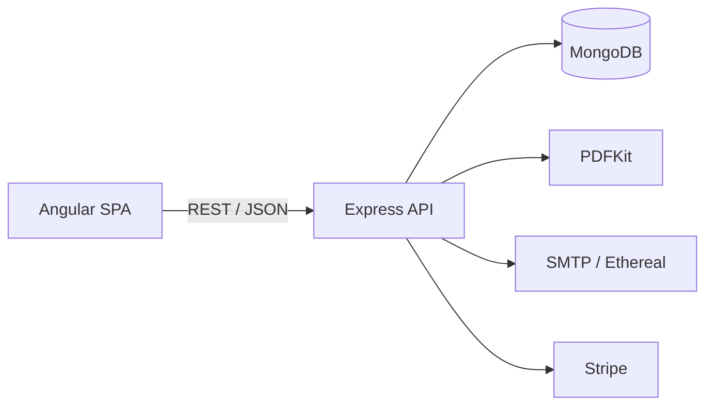

# Printing House

> A full-stack marketplace connecting customers with print shops—from product discovery and print preparation to ordering, tenders, invoicing, and payment.


<p align="center">
  
</p>

Printing House is a role-based web application for customers, print shops, and system administrators. It covers the complete print-order lifecycle and includes inventory management, public procurement, analytics, document generation, email delivery, and test payments.

## Key features

- Product search, categories, galleries, ratings, and print-shop locations
- Interactive print preparation with text/image positioning and live pricing
- Shopping cart, order tracking, cancellation, and product archive
- Print-shop inventory management and JSON batch import
- Public procurement with bidding and stock-aware winner selection
- Admin approval workflows, user/category management, and analytics
- PDF invoices and procurement reports delivered by email
- Stripe test payments with an offline development mode

## Tech stack

| Layer | Technologies |
| --- | --- |
| Frontend | Angular 20, TypeScript, RxJS, Stripe.js |
| Backend | Node.js, Express 5, TypeScript |
| Database | MongoDB, Mongoose |
| Authentication | JWT, bcrypt |
| Documents and email | PDFKit, Nodemailer, Ethereal/SMTP |
| Payments | Stripe Payment Intents |

## Architecture



## Run locally

### Prerequisites

- Node.js and npm
- MongoDB running at `mongodb://127.0.0.1:27017`

### Backend

```bash
cd backend_Node
npm install
npm run seed
npm start
```

The API runs at `http://localhost:4000`.

> `npm run seed` recreates the application's collections before inserting demo data.

The app works locally with its development defaults. To customize the database, email, JWT, or Stripe settings, copy `backend_Node/.env.example` to `backend_Node/.env` and update the required values.

### Frontend

In a second terminal:

```bash
cd frontend
npm install
npm start
```

Open `http://localhost:4200`.

## Demo accounts

These accounts are generated by `npm run seed` for local demonstration.

| Role | Username | Password | Entry point |
| --- | --- | --- | --- |
| Administrator | `admin` | `Admin123!` | `/admin/prijava` |
| Print shop | `copystudio` | `Stampar1!` | Standard sign-in |
| Customer | `pera` | `Klijent1!` | Standard sign-in |
| Company customer | `etf` | `Pravno11!` | Standard sign-in |

The company account includes a completed public-procurement example with multiple bids and a generated PDF report.

## Project structure

```text
.
├── backend_Node/
│   └── src/
│       ├── config/       # Environment and database connection
│       ├── controllers/  # Business logic
│       ├── middleware/   # Authentication and uploads
│       ├── models/       # Mongoose schemas
│       ├── routers/      # REST endpoints
│       ├── seed/         # Database and demo data
│       └── utils/        # Validation, PDF, mail, and payments
├── frontend/
│   └── src/app/
│       ├── models/       # Frontend data types
│       ├── services/     # API clients, auth, guards, and interceptors
│       └── */            # Feature components
└── docs/images/          # Project screenshots
```

## About

Developed for the **Internet Application Programming** course during the 2025/26 academic year.
